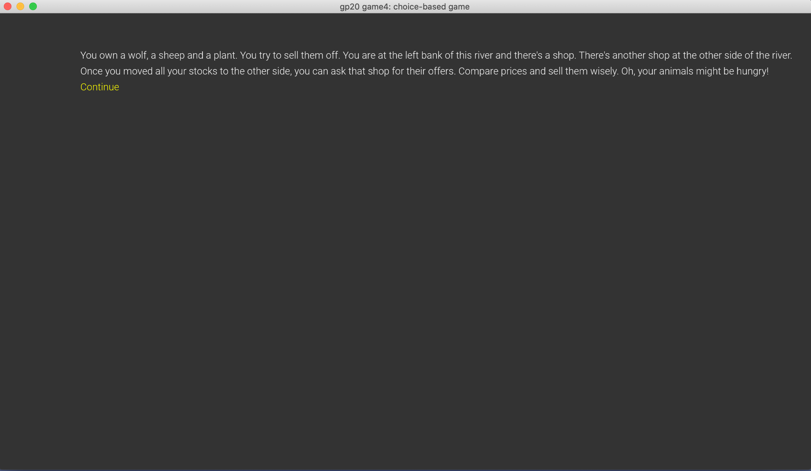

# Smart Seller

Author: Jianrong Yu

Design: You own a wolf a sheep and a plant. You want to compare prices on them across river and try to sell for the best price. 
The trick of the game is about making decisions on the order in which you want to move your three items.

Text Drawing: The texts are computed and rendered at runtime. Harfbuzz is used for shaping and freetype for getting the bitmap for each bitmap. 
The textures and glyph informations are generated in TextDrawer.cpp/hpp, stored in its Characters vector and drawn in MenuMode. 
This implementation follows the tutorial here: https://learnopengl.com/In-Practice/Text-Rendering.

It's important to note that the playMode scene also contains some texts but I believe the drawLine texts fit pretty well with scene so I did not integrate my textDrawer into the playMode scene.

Screen Shot:

How To Play:

Use ups and downs arrow keys to select your choice. You want to sell your stocks at the highest prices possible and you don't want to lose your stocks accidentally when crossing the river.

Sources: 

vegetable: https://free3d.com/3d-model/vegetable-v1--44932.html

sheep: https://free3d.com/3d-model/cartoon-low-poly-sheep-211607.html

wolf: https://free3d.com/3d-model/low-poly-wolf-4601.html

This game was built with [NEST](NEST.md).

